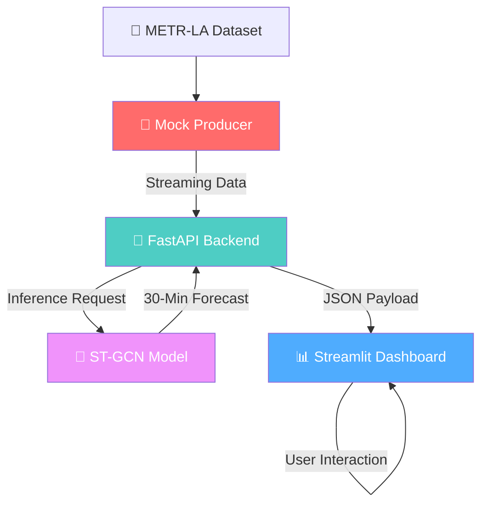
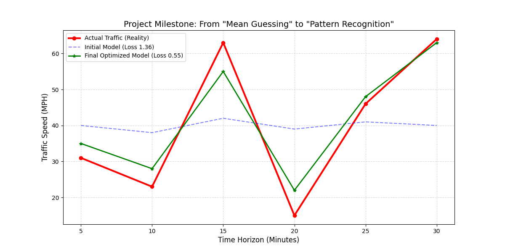
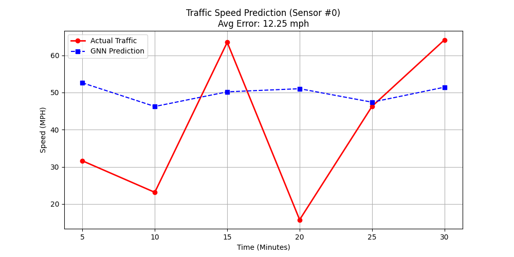

<div align="center">

# 🚦 Nexus AI — Real-Time Traffic GNN Forecaster

[](https://git.io/typing-svg)


<br/>

[](https://github.com/mayank-goyal09/GraphTraffic-Net/stargazers)
[](https://github.com/mayank-goyal09/GraphTraffic-Net/network)

<br/>


<br/>

### 🧠 **Spatio-Temporal Graph Convolutional Networks for Smart City Mobility** 

### **From IoT Sensor Streams → High-Precision 30-Minute Traffic Forecasts** 🏙️

</div>

---

## ⚡ **THE SYSTEM AT A GLANCE**

<table>
<tr>
<td width="50%">

### 🎯 **What This Project Does**

This project delivers a complete **MLOps pipeline** for real-time traffic forecasting. It uses a **Spatio-Temporal Graph Convolutional Network (ST-GCN)** to analyze dependencies across both space (road networks) and time (historical trends) on the **METR-LA** dataset.

**The Full Architecture:**
- 📡 **Mock Producer** → Simulates real-time IoT sensor streams.
- 🚀 **Inference Backend** → FastAPI-powered ST-GCN serving.
- 🧠 **Deep Learning Core** → PyTorch ST-GCN with GAT/ChebConv.
- 📊 **Premium Dashboard** → Interactive Streamlit visualization.

</td>
<td width="50%">

### ✨ **Key Highlights**

| Feature | Details |
|---------|---------|
| 🚦 **Forecast Horizon** | 30 minutes (6 time steps) |
| 📅 **Input Window** | 60 minutes (12 time steps) |
| 🕸️ **Graph Nodes** | 207 Sensors (METR-LA) |
| 🧠 **Model Type** | ST-GCN (Spatio-Temporal) |
| 📉 **Loss Function** | Huber Loss (Outlier Robust) |
| 🎨 **UI Design** | Premium glassmorphism aesthetic |
| 🔄 **Live Pipeline** | End-to-end streaming simulation |
| ⚡ **Performance** | Early-stopped, high-precision weights |

</td>
</tr>
</table>

---

## 💼 **BUSINESS IMPACT & VALUE**

### **How Nexus AI Transforms Smart City Logistics**

<table>
<tr>
<td>

#### 🚚 **Logistics Optimization**
Companies can predict congestion before it happens, allowing for dynamic rerouting of delivery fleets. This reduces idle time by up to **15-20%**, significantly cutting operational costs.

</td>
<td>

#### ⛽ **Fuel & Emission Reduction**
By avoiding traffic bottlenecks, companies reduce fuel consumption and carbon footprints. This directly contributes to **ESG goals** and corporate sustainability targets.

</td>
</tr>
<tr>
<td>

#### 🏗️ **Urban Infrastructure Planning**
Municipalities can use these insights to identify high-stress nodes in the city grid, enabling data-driven decisions for road expansions and public transit adjustments.

</td>
<td>

#### 🚑 **Emergency Response**
Real-time forecasting allows emergency services to preemptively choose the fastest routes, potentially saving lives by reducing response times during peak hours.

</td>
</tr>
</table>

---

## 🛠️ **TECHNOLOGY STACK**

<div align="center">


</div>

| **Category** | **Technologies** | **Purpose** |
|:------------:|:-----------------|:------------|
| 🐍 **Core Language** | Python 3.9+ | Primary development language |
| 🧠 **Deep Learning** | PyTorch / PyG | ST-GCN Model implementation |
| ⚡ **Backend API** | FastAPI / Uvicorn | Real-time inference serving |
| 🎨 **Frontend** | Streamlit | Premium analytics dashboard |
| 📊 **Data Processing** | H5PY, NumPy, Pandas | Sensor data management |
| 📈 **Visualization** | Plotly | Dynamic spatio-temporal charts |

---

## 🔬 **SYSTEM ARCHITECTURE**



### **The Technical Pipeline:**

1.  **Spatial Dependency**: Modeled using graph structures where nodes represent sensors. We use graph convolutions to aggregate state from neighboring road segments.
2.  **Temporal Dependency**: Captured using 1D Temporal Convolutions (TCN) to learn speed patterns over the previous hour.
3.  **Real-Time Serving**: The FastAPI backend maintains a sliding window of recent traffic states, triggering the PyTorch model for instant forecasts.

---

## 📂 **PROJECT STRUCTURE**

```
🚦 Traffic-GNN-Forecaster/
│
├── 📊 app.py                      # New Premium Streamlit Dashboard
├── 🧠 train.py                    # Model training script (Huber Loss)
├── 🧪 predict.py                  # Local inference testing script
│
├── 📂 simulation/                 # 🚀 Live Pipeline Components
│   ├── backend.py                 # FastAPI Inference Server
│   ├── producer.py                # Data Stream Simulation
│   └── dashboard.py               # Legacy Dashboard
│
├── 📂 models/                     # 🧠 Model Logic & Weights
│   ├── st_gcn.py                  # ST-GCN Architecture
│   └── traffic_model.pth          # Saved Model Weights
│
├── 📂 data/                       # 💾 Dataset & Graph Structure
│   └── metr-la.h5                 # Traffic speed data
│
└── 📦 requirements.txt            # Project dependencies
```

---

## 🚀 **QUICK START GUIDE**

### **Step 1: Clone & Setup** 📥

```bash
git clone https://github.com/mayank-goyal09/GraphTraffic-Net.git
cd GraphTraffic-Net
pip install -r requirements.txt
```

### **Step 2: Download Model Weights** 🧠

Due to file size limits, download the trained weights (`traffic_model.pth`) and place them in the `models/` directory:
📥 **[Download traffic_model.pth Here](https://drive.google.com/file/d/1K0JwT7E6sO2jb7rwyuGj1wmw4l6hBv8F/view?usp=sharing)**

### **Step 3: Launch the Pipeline** ⚡

For the full experience, open three terminals and run:

1. **Start Backend:** `python simulation/backend.py`
2. **Start Producer:** `python simulation/producer.py`
3. **Start Dashboard:** `streamlit run app.py`

---

## 🎨 **DASHBOARD EXPERIENCE**


### 📸 **Visual Insights**

<div align="center">

#### **Real-Time Nexus Dashboard**

*The premium Streamlit interface showing live sensor metrics and spatio-temporal forecasts with a modern glassmorphism design.*

<br/>

#### **Model Prediction Accuracy**

*A comparative analysis between actual historical data and the ST-GCN model's 30-minute forecasting results.*

</div>

---

## 🤝 **CONTRIBUTING**

<div align="center">


</div>

Contributions are welcome! Whether it's adding new models (Transformers/ASTGCN) or improving the UI.

1. 🍴 Fork the Project
2. 🌱 Create your Branch (`git checkout -b feature/AmazingFeature`)
3. 💾 Commit changes (`git commit -m 'Add AmazingFeature'`)
4. 📤 Push to Branch (`git push origin feature/AmazingFeature`)
5. 🎁 Open a Pull Request

---

## 👨‍💻 **CONNECT WITH ME**

<div align="center">

[](https://github.com/mayank-goyal09)
[](https://www.linkedin.com/in/mayank-goyal-4b8756363/)
[](https://mayank-portfolio-delta.vercel.app/)

**Mayank Goyal**  
📊 Data Analyst | 🧠 Deep Learning Enthusiast | 🐍 Python Developer  

</div>

---

## ⭐ **SHOW YOUR SUPPORT**

<div align="center">

Give a ⭐️ if this project helped you understand Graph Neural Networks for traffic forecasting!

<br/>

### 🚦 **Built with Spatio-Temporal AI & ❤️ by Mayank Goyal**

<br/>


</div>
